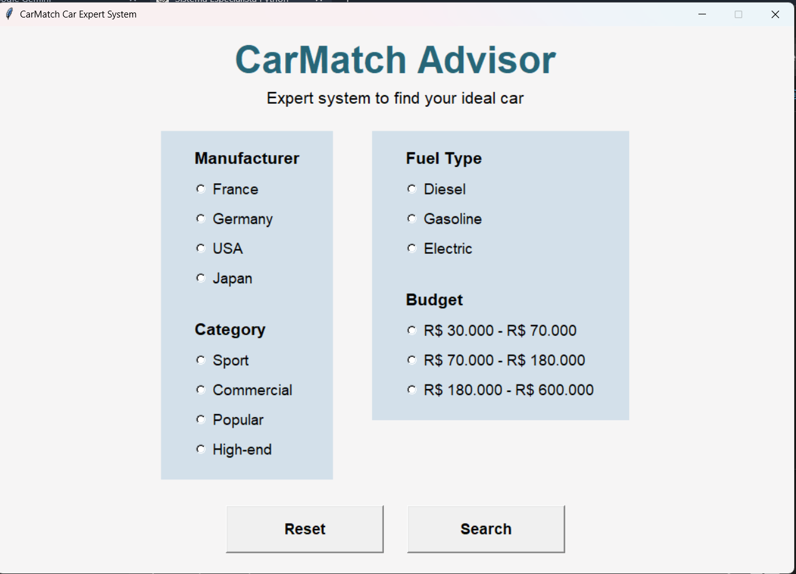
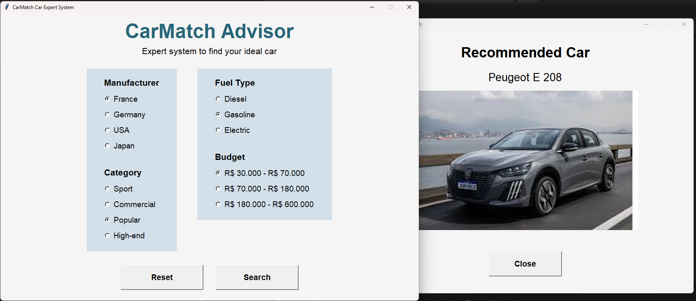
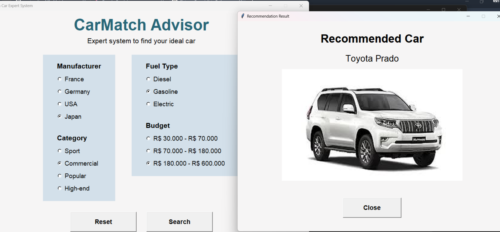
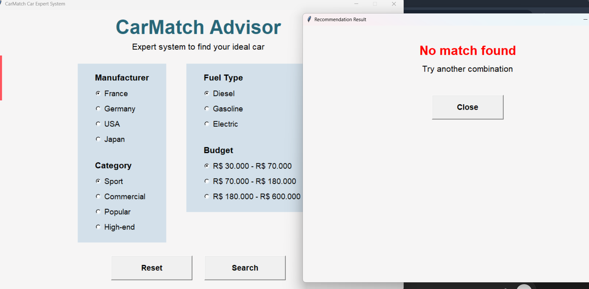

# CarMatch

**CarMatch** is a simple expert system that helps users find a suitable car based on their preferences.

The application uses **rule-based inference** to recommend a car model according to selected criteria such as:

* Manufacturer country
* Car category
* Fuel type
* Budget

The expert system logic is implemented with the **Experta** library, while the graphical interface is built using **Tkinter**.

---

# Features

* Rule-based expert system
* Interactive graphical interface
* Car recommendation based on user preferences
* Visual result with car image
* Simple and lightweight Python application

---

# Technologies Used

* **Python 3**
* **Experta** – rule-based expert system engine
* **Tkinter** – GUI framework
* **Pillow (PIL)** – image handling

---

# Project Structure

```
CarMatch
│
├── icons
│   ├── car.jpg
│   ├── reset_img.jpg
│   └── save.webp
│
├── images
│   ├── audi_a4.jpg
│   ├── audi_rs3.jpg
│   ├── mercedes_class_a.jpg
│   ├── peugeot_e_208.jpg
│   ├── tesla_model_3.jpg
│   ├── toyota_hylux.jpg
│   └── toyota_prado.jpg
│
├── screenshots
│   ├── main-ui.png
│   ├── not-found.png
│   ├── peogeut.png
│   └── toyota-prado.png
│
├── CarMatch.py
└── README.md
```

---

# Screenshots

## Main Interface


## Recommendation Example - Peugeot


## Recommendation Example - Toyota Prado


## No Match Found


---

# Installation

## Clone the repository

```bash
git clone https://github.com/gustavolimaf/CarMatch.git
```

Enter the project directory

```bash
cd CarMatch
```

---

# Install Dependencies

Install the required Python packages:

```bash
pip install experta pillow
```

> Tkinter usually comes preinstalled with Python.

---

# Run the Application

Run the main script:

```bash
python CarMatch.py
```

---

# How to Use

1. Launch the application.
2. Select the following criteria:

   * Manufacturer
   * Car category
   * Fuel type
   * Budget range
3. Click **Search**.
4. The system will recommend a car based on the rule-based expert system.

If no rule matches the selected criteria, the system will notify the user.

---

# Expert System Logic

CarMatch uses **forward chaining inference**.

Process:

```
User Preferences
        ↓
Facts
        ↓
Rule Matching
        ↓
Car Recommendation
```

The rules determine:

1. The **car brand**
2. The **specific model based on budget**

---

# License

This project is for educational purposes.
